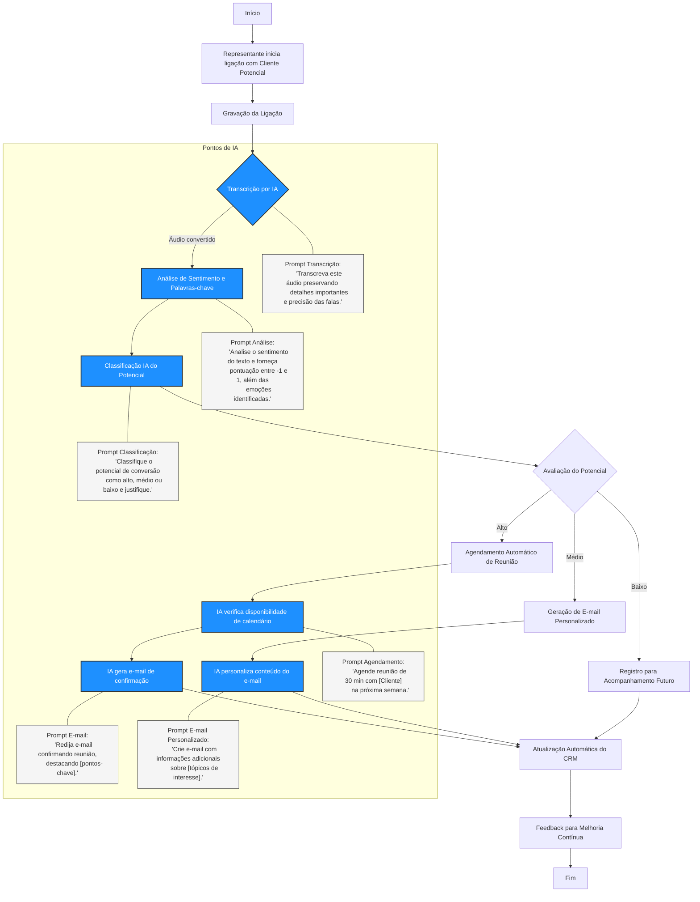

# Fluxo de Análise de Ligações Comerciais com IA 🤖

Este repositório contém a documentação detalhada do processo de análise automatizada de ligações comerciais, utilizando Inteligência Artificial para otimizar o fechamento de vendas e agendamento de reuniões.

## 📋 Índice

- [Visão Geral](#visão-geral)
- [Fluxo do Processo](#fluxo-do-processo)
- [Integração com IA](#integração-com-ia)
- [Prompts de IA](#prompts-de-ia)
- [Implementação](#implementação)
- [Benefícios](#benefícios)
- [Como Contribuir](#como-contribuir)

## 🎯 Visão Geral

O sistema automatiza a análise de ligações comerciais através da integração de IA em pontos estratégicos do processo, desde a transcrição da ligação até o agendamento automático de reuniões, permitindo:

- Análise em tempo real de ligações comerciais
- Classificação automática de leads
- Personalização da comunicação com clientes
- Otimização do tempo da equipe comercial
- Melhoria contínua do processo de vendas

## 🔄 Fluxo do Processo

O processo é representado pelo seguinte fluxograma:



## 🤖 Integração com IA

O sistema utiliza IA em seis pontos críticos do processo:

1. **Transcrição Automática**
   - Converte áudio da ligação em texto
   - Preserva detalhes importantes e nuances da conversa
   - Permite análise posterior do conteúdo

2. **Análise de Sentimento**
   - Avalia o tom e emoções do cliente
   - Identifica palavras-chave relevantes
   - Gera pontuação de -1 a 1 para classificação

3. **Classificação de Potencial**
   - Categoriza leads em Alto, Médio ou Baixo potencial
   - Considera múltiplos fatores da análise
   - Direciona próximas ações automaticamente

4. **Agendamento Inteligente**
   - Verifica disponibilidade de calendário
   - Sugere horários adequados
   - Confirma automaticamente reuniões

5. **Geração de E-mails**
   - Cria e-mails personalizados baseados na conversa
   - Adapta tom e conteúdo ao contexto
   - Inclui informações relevantes automaticamente

6. **Atualização de CRM**
   - Registra todas as interações
   - Mantém histórico atualizado
   - Facilita acompanhamento futuro

## 📝 Prompts de IA

Para cada ponto de integração, utilizamos prompts específicos:

### 1. Transcrição
```
Transcreva este áudio preservando detalhes importantes e precisão das falas.
```

### 2. Análise de Sentimento
```
Analise o sentimento do texto e forneça pontuação entre -1 e 1, além das emoções identificadas.
```

### 3. Classificação
```
Classifique o potencial de conversão como alto, médio ou baixo e justifique.
```

### 4. Agendamento
```
Agende reunião de 30 min com [Cliente] na próxima semana.
```

### 5. E-mail de Confirmação
```
Redija e-mail confirmando reunião, destacando [pontos-chave].
```

### 6. E-mail Personalizado
```
Crie e-mail com informações adicionais sobre [tópicos de interesse].
```

## 🛠️ Implementação

### Requisitos Técnicos

1. **Sistema de Gravação**
   - Capacidade de gravação em alta qualidade
   - Armazenamento seguro
   - Integração com API de transcrição

2. **APIs de IA**
   - Serviço de transcrição
   - Análise de sentimento
   - Processamento de linguagem natural

3. **Integrações**
   - Sistema de calendário
   - CRM
   - Sistema de e-mail

### Configuração

1. Configure as credenciais das APIs
2. Defina parâmetros de classificação
3. Estabeleça templates de e-mail
4. Configure integrações com calendário e CRM

## 📈 Benefícios

1. **Eficiência Operacional**
   - Redução de tarefas manuais
   - Agilidade no processo de vendas
   - Melhor aproveitamento do tempo da equipe

2. **Qualidade do Atendimento**
   - Respostas mais rápidas
   - Comunicação personalizada
   - Acompanhamento consistente

3. **Análise e Melhorias**
   - Dados estruturados para análise
   - Identificação de padrões
   - Oportunidades de otimização

## 🤝 Como Contribuir

1. Faça um Fork do projeto
2. Crie uma Branch para sua Feature (`git checkout -b feature/AmazingFeature`)
3. Commit suas mudanças (`git commit -m 'Add some AmazingFeature'`)
4. Push para a Branch (`git push origin feature/AmazingFeature`)
5. Abra um Pull Request

## 📄 Licença

Este projeto está sob a licença MIT. Veja o arquivo [LICENSE](LICENSE) para mais detalhes.

---

Desenvolvido com ❤️ para otimizar processos comerciais.
